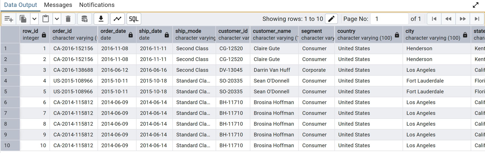
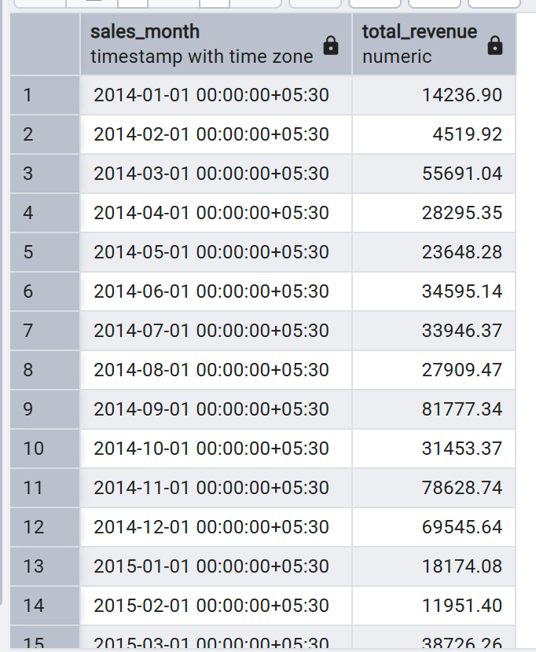
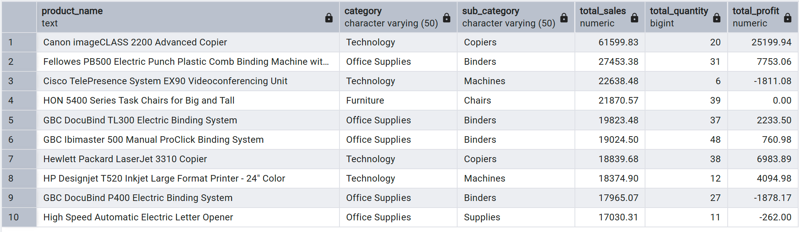
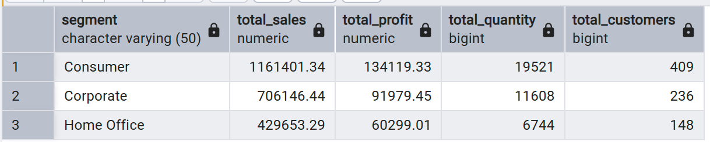
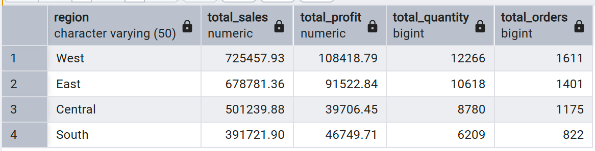
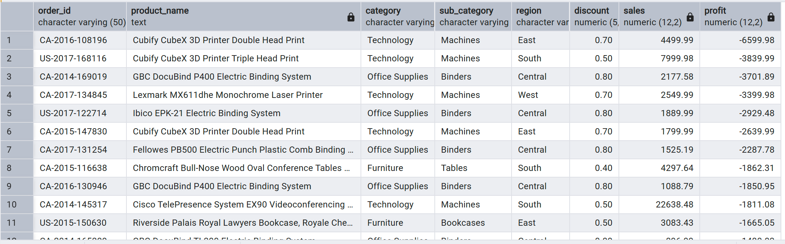
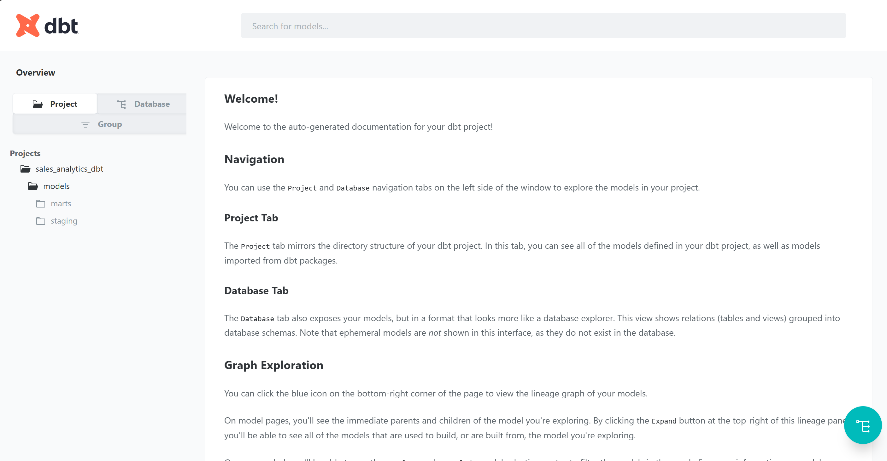
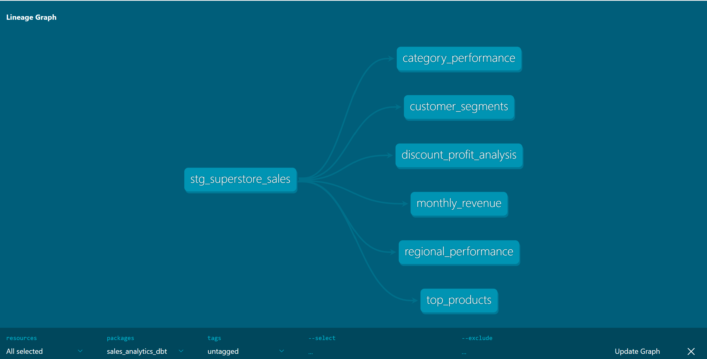
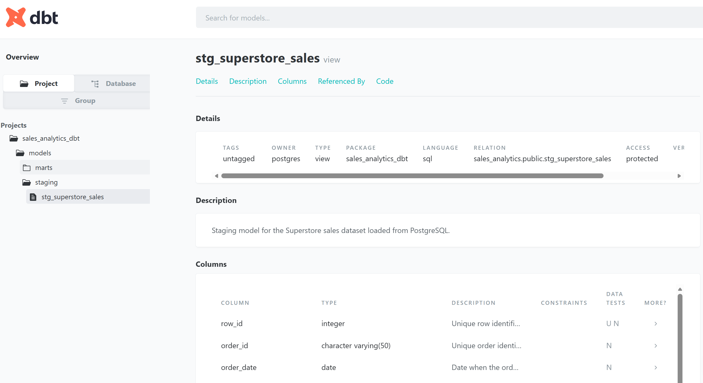
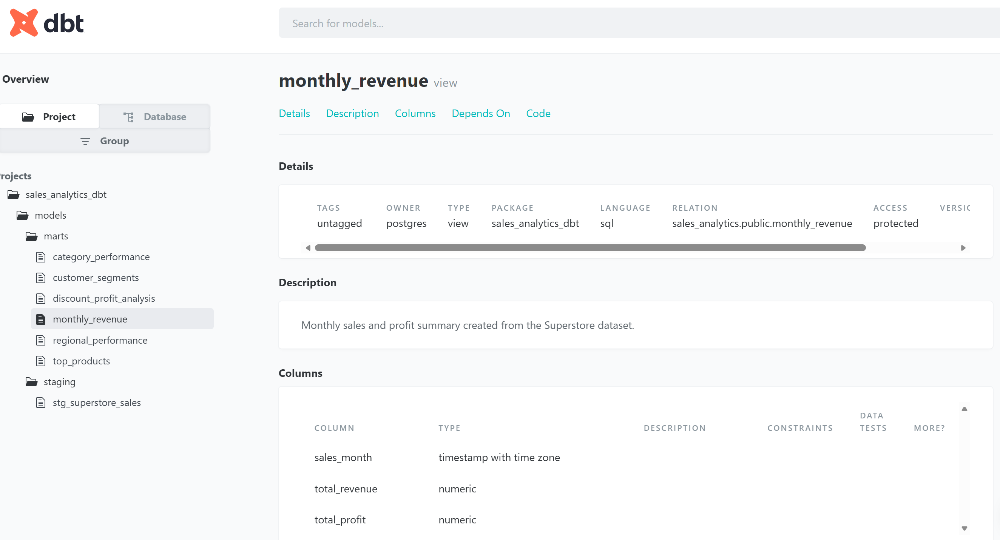

# Sales Analytics Pipeline

A data analytics pipeline project using **PostgreSQL** and **SQL** to analyze retail sales performance from the Superstore Sales Dataset.

This project focuses on loading raw CSV sales data into PostgreSQL and writing SQL queries to generate business insights related to revenue, products, customer segments, regions, discounts, and profitability.

## Project Overview

A Superstore business wants to understand which products, regions, categories, and customer segments are performing well or poorly. The goal of this project is to analyze sales data and identify useful insights that can support better business decisions.

Current project flow:

```text
CSV Dataset -> PostgreSQL Database -> SQL Analysis -> Business Insights
```

Planned future pipeline:

```text
CSV Dataset -> PostgreSQL -> dbt Core -> Airflow -> Lightdash Dashboard
```

## Tools Used

- PostgreSQL - Database used to store the sales dataset
- pgAdmin 4 - Tool used to manage PostgreSQL and run SQL queries
- SQL - Used for data analysis and business insights
- dbt Core - Planned for data transformation models
- Apache Airflow - Planned for daily pipeline scheduling
- Lightdash - Planned for dashboard visualization

## Dataset

This project uses the **Superstore Sales Dataset**, originally sourced from Tableau and commonly used for sales and business analytics practice.

The dataset contains order-level retail sales data, including customer details, product categories, regional information, sales, quantity, discount, and profit.

### Key Columns

- Row ID
- Order ID
- Order Date
- Ship Date
- Ship Mode
- Customer ID
- Customer Name
- Segment
- Country
- City
- State
- Postal Code
- Region
- Product ID
- Category
- Sub-Category
- Product Name
- Sales
- Quantity
- Discount
- Profit

## Business Questions

This project answers the following business questions:

1. How does revenue change month by month?
2. Which products generate the highest sales?
3. Which customer segments bring the most revenue and profit?
4. Which regions perform best in sales and profit?
5. Which states generate the highest sales?
6. Are high discounts reducing profit?
7. Which categories and sub-categories are profitable or unprofitable?

## Project Structure

```text
sales-analytics-pipeline/
|
|-- data/
|   |-- sales_data_clean.csv
|   |-- sales_data.csv
|
|-- sql/
|   |-- 02_create_tables.sql
|   |-- 04_analysis_queries.sql
|   |-- data_validation.sql
|
|-- README.md
```

## Screenshots

### Table Preview



### Revenue by Month



### Top Products



### Customer Segment Performance



### Regional Sales Performance



### High Discount Orders with Negative Profit



### dbt Documentation Home



### dbt Lineage Graph



### dbt Staging Model



### dbt Monthly Revenue Model



## dbt Core Implementation

dbt Core was added to organize SQL transformations into reusable models.

### dbt Model Layers

- `stg_superstore_sales` - staging model created from the raw PostgreSQL table
- `monthly_revenue` - monthly sales and profit summary
- `top_products` - product-level sales and profit analysis
- `customer_segments` - segment-level performance analysis
- `regional_performance` - regional sales and profit performance
- `discount_profit_analysis` - discount impact on sales and profit
- `category_performance` - category and sub-category performance analysis

### dbt Commands Used

```bash
dbt debug
dbt run
dbt test
dbt docs generate
dbt docs serve
```

### dbt Tests

Data quality tests were added for important fields such as:

- `row_id`
- `order_id`
- `order_date`
- `customer_id`
- `product_id`
- `sales`
- `quantity`
- `profit`

## Database Table

The dataset was imported into a PostgreSQL table called:

```text
superstore_sales
```

The table stores sales, customer, product, regional, and profit data from the CSV file.

## SQL Analysis Performed

### 1. Revenue by Month

Analyzed monthly revenue trends using order dates and sales values.

```sql
SELECT 
    DATE_TRUNC('month', order_date) AS sales_month,
    ROUND(SUM(sales), 2) AS total_revenue
FROM superstore_sales
GROUP BY sales_month
ORDER BY sales_month;
```

### 2. Top Products by Sales

Identified the top-selling products based on total sales, quantity sold, and profit.

```sql
SELECT 
    product_name,
    category,
    sub_category,
    ROUND(SUM(sales), 2) AS total_sales,
    SUM(quantity) AS total_quantity,
    ROUND(SUM(profit), 2) AS total_profit
FROM superstore_sales
GROUP BY product_name, category, sub_category
ORDER BY total_sales DESC
LIMIT 10;
```

### 3. Customer Segment Performance

Compared sales and profit across customer segments.

```sql
SELECT 
    segment,
    ROUND(SUM(sales), 2) AS total_sales,
    ROUND(SUM(profit), 2) AS total_profit,
    SUM(quantity) AS total_quantity,
    COUNT(DISTINCT customer_id) AS total_customers
FROM superstore_sales
GROUP BY segment
ORDER BY total_sales DESC;
```

### 4. Regional Sales Performance

Analyzed total sales, profit, quantity, and order count by region.

```sql
SELECT 
    region,
    ROUND(SUM(sales), 2) AS total_sales,
    ROUND(SUM(profit), 2) AS total_profit,
    SUM(quantity) AS total_quantity,
    COUNT(DISTINCT order_id) AS total_orders
FROM superstore_sales
GROUP BY region
ORDER BY total_sales DESC;
```

### 5. Discount Impact on Profit

Analyzed whether higher discounts are connected with lower or negative profit.

```sql
SELECT 
    discount,
    COUNT(*) AS total_orders,
    ROUND(SUM(sales), 2) AS total_sales,
    ROUND(SUM(profit), 2) AS total_profit,
    ROUND(AVG(profit), 2) AS avg_profit_per_order
FROM superstore_sales
GROUP BY discount
ORDER BY discount;
```

## Key Insights

- Some products generated high sales but resulted in low or negative profit.
- High discount levels were linked with negative profit in several orders.
- Certain sub-categories, especially in Technology and Office Supplies, need pricing and discount review.
- Regional performance varies, so sales and profit should be analyzed separately.
- Customer segments can be compared to identify the most valuable business audience.

## Example Business Insight

Some top-selling products had negative profit, which means high revenue does not always mean strong business performance. The business should review discount strategies and product pricing for low-margin products.

## Future Improvements

- Add dbt Core to create staging and analytics models
- Add dbt tests and documentation
- Use Apache Airflow to schedule daily dbt runs
- Connect Lightdash to dbt models
- Build dashboards for:
  - Revenue by month
  - Top products
  - Customer segments
  - Regional sales performance
  - Discount vs profit analysis
- Add a regression model to predict sales or profit

## Project Status

Current stage: **PostgreSQL + SQL analysis completed**

Next stage: **Add dbt Core for data transformation**